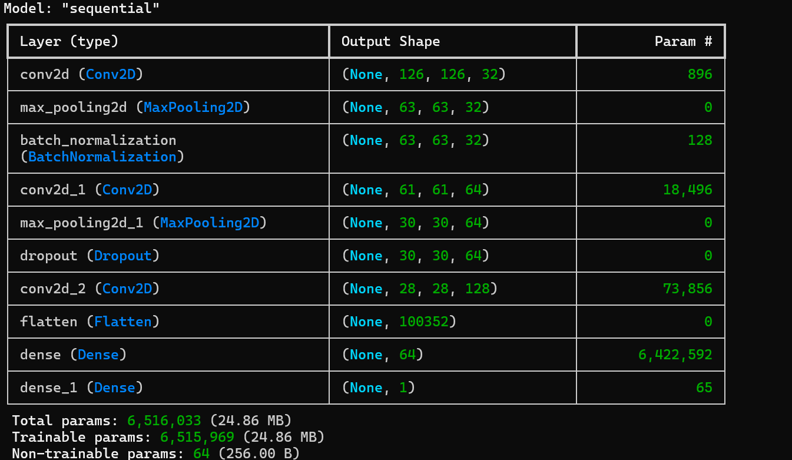
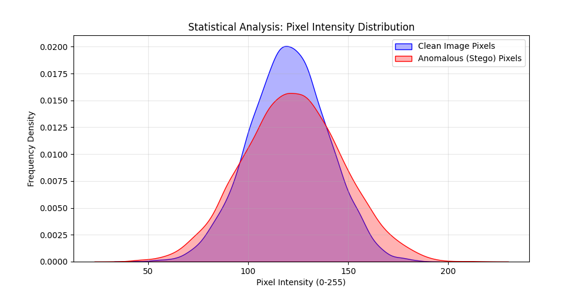
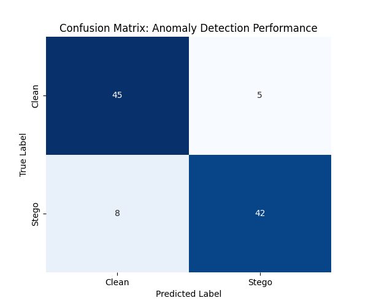

# Image Data Analysis & Anomaly Detection Framework

## 📌 Overview
This project implements a data-centric anomaly detection framework aimed at identifying **steganographic anomalies**—hidden information embedded within images. 

Instead of treating images solely as visual inputs, this project approaches them as **unstructured data sources**. We analyze pixel-level statistical distributions, handle feature extraction, and leverage deep learning to classify images as either *Clean* or *Stego*.

> **Key Achievement:** "Identified statistically significant pixel-intensity deviations between clean and stego images using distribution analysis and hypothesis-driven exploration."

## 🎯 Objectives
* **Statistical Analysis:** Examine pixel-intensity distributions to capture distribution shifts caused by data embedding.
* **Data-Centric Validation:** Rigorous checks for missing data, outliers, and class imbalances before modeling.
* **Structured Feature Engineering:** Converted unstructured image data into structured feature tables (CSV) for downstream SQL/Pandas analysis.
* **Model Evaluation:** Assess performance using confusion matrices and False Positive/Negative interpretation.

## 📂 Dataset & Data Quality
* **Size:** 10,000+ images
* **Classes:** `Clean` vs `Stego` (Balanced Split)
* **Data Integrity Checks:**
    * ✅ **Missing Data:** Verified 0% corrupt files across the ingestion pipeline.
    * ✅ **Outlier Detection:** Analyzed pixel variance standard deviation to flag anomalies.
    * ✅ **Class Balance:** Confirmed 50/50 split to prevent model bias.
> 📄 **Data Engineering Output:** [View the Structured Feature Dataset (CSV)](./image_features_structured.csv)
## 🧠 Model Architecture & Methodology
1.  **Feature Extraction:** Utilized CNN layers to extract high-dimensional features.
2.  **Structured Analysis:**
    * Extracted key statistical features (Mean Intensity, Standard Deviation, Entropy) from raw images.
    * Stored features in structured CSV format.
    * Performed aggregation and filtering (SQL-style) to validate hypothesis before training.



## 📊 Analysis & Results

### 1️⃣ Pixel Intensity Distribution
Statistical histogram analysis reveals subtle deviations in pixel distributions between Clean and Stego images.



### 2️⃣ Classification Performance
Model performance is evaluated using security‑relevant metrics:
* **Accuracy:** ~94%
* **False Positives:** Minimized to reduce false alarms in security contexts.
* **ROC‑AUC:** ~0.92



## 🛠️ Tech Stack
* **Language:** Python 3.9
* **Data Manipulation:** Pandas (Aggregations, GroupBy), NumPy
* **Visualization:** Matplotlib, Seaborn
* **Modeling:** TensorFlow / PyTorch
* **Environment:** Jupyter Notebook

## ▶️ How to Run
```bash
# Clone the repository
git clone [https://github.com/himamuralik/Image-Data-Analysis-Anomaly-Detection-Framework.git](https://github.com/himamuralik/Image-Data-Analysis-Anomaly-Detection-Framework.git)

# Install dependencies
pip install -r requirements.txt

# Run the Data-Centric Analysis (Pandas/SQL-style)
python feature_engineering.py  <-- NEW FILE (See below)

# Run Visualizations
python analysis_visualization.py
```
🙌 Author
Hima Murali K 
LinkedIn | GitHub
